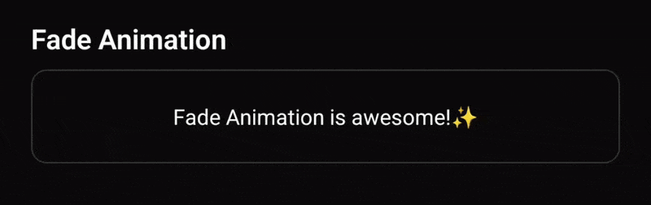
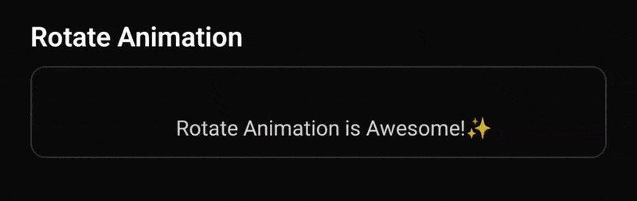
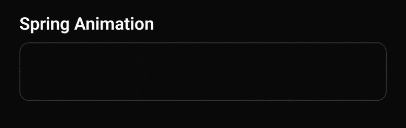
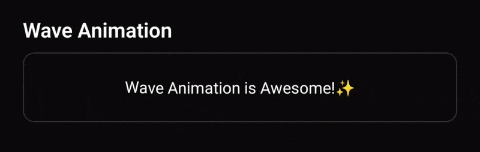

# react-native-text-animations

A lightweight React Native library for smooth, customizable text animations built with Reanimated. Plug-and-play animated text with flexible props to bring your typography to life.

## 🎬 Animations Preview

<div align="center">

| FadeText                                                                                         | RotateText                                                                                           |
| ------------------------------------------------------------------------------------------------ | ---------------------------------------------------------------------------------------------------- |
|  |  |

| SpringText                                                                                           | WaveText                                                                                         |
| ---------------------------------------------------------------------------------------------------- | ------------------------------------------------------------------------------------------------ |
|  |  |

</div>

<p align="center"><i>All animations above are powered by react-native-text-animations 🚀</i></p>

---

## Installation

```sh
npm install react-native-text-animations
```

## Dependencies

```sh
npm install react-native-reanimated react-native-worklets
```

If you’re using Expo SDK 54 or later, these dependencies are preconfigured.
Note: Since this library relies on Reanimated v4, enabling the new architecture is mandatory.

## Usage

### 🎨 Available Components

The library exposes **five powerful components** to bring your text to life:

### Pre-built Animation Components

- **`FadeText`** - Smooth fade-in/out animations with customizable opacity transitions
- **`RotateText`** - Dynamic rotation effects for eye-catching text
- **`SpringText`** - Bouncy, spring-based animations with natural motion
- **`WaveText`** - Flowing wave effects that ripple through your text

### Customizable Component

- **`AnimatedText`** (default export) - A fully customizable component for creating your own unique animations with maximum flexibility

---

## 📖 Component API

### FadeText

Animate text with smooth fade transitions and positional offsets.

#### Props

| Prop           | Type     | Default | Description                                           |
| -------------- | -------- | ------- | ----------------------------------------------------- |
| `duration`     | `number` | `300`   | Animation duration for each segment (in milliseconds) |
| `delay`        | `number` | -       | Delay before the animation starts (in milliseconds)   |
| `staggerDelay` | `number` | `50`    | Delay between each animated segment (in milliseconds) |
| `offsetX`      | `number` | -       | Initial horizontal offset on the X-axis               |
| `offsetY`      | `number` | `10`    | Initial vertical offset on the Y-axis                 |
| `fromOpacity`  | `number` | `0`     | Starting opacity value (0 to 1)                       |
| `toOpacity`    | `number` | `1`     | Ending opacity value (0 to 1)                         |

#### Example

```javascript
import { FadeText } from 'react-native-text-animations';

<FadeText
  duration={1000}
  delay={200}
  staggerDelay={50}
  offsetY={20}
  fromOpacity={0}
  toOpacity={1}
>
  Hello, World!
</FadeText>;
```

---

### RotateText

Create dynamic rotation effects with full control over X, Y, and Z axes transformations.

#### Props

| Prop             | Type     | Default | Description                                           |
| ---------------- | -------- | ------- | ----------------------------------------------------- |
| `duration`       | `number` | 300     | Animation duration for each segment (in milliseconds) |
| `delay`          | `number` | -       | Delay before the animation starts (in milliseconds)   |
| `staggerDelay`   | `number` | 50      | Delay between each animated segment (in milliseconds) |
| `offsetX`        | `number` | 10      | Initial horizontal offset on the X-axis               |
| `offsetY`        | `number` | 10      | Initial vertical offset on the Y-axis                 |
| `initialOpacity` | `number` | 0.8     | Starting opacity value (0 to 1)                       |
| `rotateXStart`   | `number` | -       | Initial rotation angle around the X-axis (in degrees) |
| `rotateXEnd`     | `number` | -       | Final rotation angle around the X-axis (in degrees)   |
| `rotateYStart`   | `number` | 360     | Initial rotation angle around the Y-axis (in degrees) |
| `rotateYEnd`     | `number` | -       | Final rotation angle around the Y-axis (in degrees)   |
| `rotateZStart`   | `number` | -       | Initial rotation angle around the Z-axis (in degrees) |
| `rotateZEnd`     | `number` | -       | Final rotation angle around the Z-axis (in degrees)   |

#### Example

```javascript
import { RotateText } from 'react-native-text-animations';

<RotateText
  duration={1200}
  delay={100}
  staggerDelay={80}
  initialOpacity={0}
  rotateYStart={90}
  rotateYEnd={0}
  offsetX={-20}
>
  Rotating Text!
</RotateText>;
```

---

### SpringText

Add playful, bouncy spring animations with natural physics-based motion and scaling effects.

#### Props

| Prop             | Type         | Default        | Description                                                                         |
| ---------------- | ------------ | -------------- | ----------------------------------------------------------------------------------- |
| `duration`       | `number`     | 300            | Animation duration for each segment (in milliseconds)                               |
| `delay`          | `number`     | -              | Delay before the animation starts (in milliseconds)                                 |
| `staggerDelay`   | `number`     | 50             | Delay between each animated segment (in milliseconds)                               |
| `offsetX`        | `number`     | -              | Initial horizontal offset on the X-axis                                             |
| `offsetY`        | `number`     | -10            | Initial vertical offset on the Y-axis                                               |
| `scaleFrom`      | `number`     | 0.5            | Initial scale value (e.g., 0.5 for 50% size)                                        |
| `scaleTo`        | `number`     | 1              | Final scale value (e.g., 1 for 100% size)                                           |
| `initialOpacity` | `number`     | 0              | Starting opacity value (0 to 1)                                                     |
| `bounce`         | `BounceType` | {x: 2, y: 0.5} | Bounce intensity. Can be a single number or object with separate `x` and `y` values |

#### Types

```typescript
type BounceType = number | { x?: number; y?: number };
```

#### Example

```javascript
import { SpringText } from 'react-native-text-animations';

<SpringText
  duration={800}
  delay={150}
  staggerDelay={60}
  scaleFrom={0}
  scaleTo={1}
  initialOpacity={0}
  bounce={0.5}
>
  Bouncy Text!
</SpringText>;
```

---

### WaveText

Create mesmerizing wave effects that flow through your text with smooth, rhythmic motion.

#### Props

| Prop             | Type      | Default | Description                                           |
| ---------------- | --------- | ------- | ----------------------------------------------------- |
| `duration`       | `number`  | 300     | Animation duration for each segment (in milliseconds) |
| `delay`          | `number`  | -       | Delay before the animation starts (in milliseconds)   |
| `staggerDelay`   | `number`  | 50      | Delay between each animated segment (in milliseconds) |
| `amplitude`      | `number`  | 10      | Height/intensity of the wave effect (in pixels)       |
| `initialOpacity` | `number`  | 1       | Starting opacity value (0 to 1)                       |
| `infinite`       | `boolean` | false   | Whether the wave animation should loop continuously   |

#### Example

```javascript
import { WaveText } from 'react-native-text-animations';

<WaveText duration={1000} staggerDelay={100} amplitude={20} initialOpacity={0}>
  Wave Effect!
</WaveText>;
```

---

### AnimatedText (Default Export)

The ultimate flexible component that combines all animation capabilities. Create custom animations by composing any combination of fade, rotate, scale, and bounce effects.

#### Props

| Prop     | Type                 | Required | Description                                          |
| -------- | -------------------- | -------- | ---------------------------------------------------- |
| `config` | `AnimatedTextConfig` | No       | Configuration object defining the animation behavior |

#### AnimatedTextConfig Type

```typescript
type AnimatedTextConfig = {
  duration?: number;
  delay?: number;
  staggerDelay?: number;
  offsetX?: number;
  offsetY?: number;
  fromOpacity?: number;
  toOpacity?: number;
  rotateFrom?: {
    x?: number;
    y?: number;
    z?: number;
  };
  rotateTo?: {
    x?: number;
    y?: number;
    z?: number;
  };
  scaleFrom?: number;
  scaleTo?: number;
  bounce?: BounceType;
};

type BounceType = number | { x?: number; y?: number };
```

#### Config Properties

| Property       | Type                               | Default       | Description                                           |
| -------------- | ---------------------------------- | ------------- | ----------------------------------------------------- |
| `duration`     | `number`                           | 300           | Animation duration for each segment (in milliseconds) |
| `delay`        | `number`                           | -             | Delay before the animation starts (in milliseconds)   |
| `staggerDelay` | `number`                           | 50            | Delay between each animated segment (in milliseconds) |
| `offsetX`      | `number`                           | -             | Initial horizontal offset on the X-axis               |
| `offsetY`      | `number`                           | 10            | Initial vertical offset on the Y-axis                 |
| `fromOpacity`  | `number`                           | -             | Starting opacity value (0 to 1)                       |
| `toOpacity`    | `number`                           | 1             | Ending opacity value (0 to 1)                         |
| `rotateFrom`   | `{ x:number, y:number, z:number }` | -             | Initial rotation angles for X, Y, Z axes (in degrees) |
| `rotateTo`     | `{ x:number, y:number, z:number }` | -             | Final rotation angles for X, Y, Z axes (in degrees)   |
| `scaleFrom`    | `number`                           | 1             | Initial scale value (e.g., 0.5 for 50% size)          |
| `scaleTo`      | `number`                           | 1             | Final scale value (e.g., 1 for 100% size)             |
| `bounce`       | `BounceType`                       | { x: 0,y: 0 } | Bounce intensity (number or object with x/y values)   |

#### Examples

```javascript
import AnimatedText, { AnimatedTextConfig } from 'react-native-text-animations';

// Inline config
<AnimatedText
  config={{
    duration: 1000,
    staggerDelay: 50,
    fromOpacity: 0,
    toOpacity: 1,
    scaleFrom: 0.8,
    scaleTo: 1,
    offsetY: 20,
  }}
>
  Custom Animation!
</AnimatedText>

// Separate config (recommended for reusability)
const myAnimationConfig: AnimatedTextConfig = {
  duration: 1200,
  delay: 200,
  staggerDelay: 80,
  fromOpacity: 0,
  toOpacity: 1,
  rotateFrom: { y: 90, z: -10 },
  rotateTo: { y: 0, z: 0 },
  scaleFrom: 0.5,
  scaleTo: 1,
  offsetX: -30,
  bounce: { x: 0.3, y: 0.5 },
};

<AnimatedText config={myAnimationConfig}>
  Complex Animation!
</AnimatedText>

// Combining multiple effects
const fadeRotateScale: AnimatedTextConfig = {
  duration: 800,
  staggerDelay: 60,
  fromOpacity: 0,
  toOpacity: 1,
  rotateFrom: { x: 45, y: 45 },
  rotateTo: { x: 0, y: 0 },
  scaleFrom: 0.3,
  scaleTo: 1,
};

<AnimatedText config={fadeRotateScale}>
  Multi-effect Text!
</AnimatedText>
```

#### 💡 Pro Tips

- **Reusability**: Export your `AnimatedTextConfig` objects to reuse across your app
- **Composition**: Combine multiple animation properties for unique effects
- **Performance**: Use `staggerDelay` wisely for smooth sequential animations
- **Experimentation**: Mix and match properties to discover creative animations

---

## 🔧 Common Props

All animation components share these common properties for controlling text content and behavior.

#### Props

| Prop                    | Type                   | Required | Default | Description                                                                                               |
| ----------------------- | ---------------------- | -------- | ------- | --------------------------------------------------------------------------------------------------------- |
| `text`                  | `string`               | **Yes**  | -       | The text content to be animated                                                                           |
| `textStyle`             | `StyleProp<TextStyle>` | No       | -       | Style object to customize the appearance of the animated text                                             |
| `staggerSeparator`      | `string`               | No       | `""`    | Character(s) used to split text into animated segments. Empty string animates each character individually |
| `reanimateOnTextChange` | `boolean`              | No       | `false` | Whether to restart the animation when the `text` prop changes                                             |

#### Examples

```javascript
import { FadeText } from 'react-native-text-animations';

// Basic usage with required text prop
<FadeText
  text="Hello World"
  duration={1000}
  fromOpacity={0}
  toOpacity={1}
/>

// With custom text styling
<FadeText
  text="Styled Text"
  textStyle={{
    fontSize: 24,
    fontWeight: 'bold',
    color: '#FF6B6B',
  }}
  duration={800}
  staggerDelay={50}
/>

// Animate words instead of characters
<FadeText
  text="Animate each word separately"
  staggerSeparator=" "
  duration={600}
  staggerDelay={100}
/>

// Reanimate on text change
<FadeText
  text={dynamicText}
  reanimateOnTextChange={true}
  duration={500}
  fromOpacity={0}
  toOpacity={1}
/>

// Animate by custom separator (e.g., sentences)
<SpringText
  text="First sentence.Second sentence.Third sentence"
  staggerSeparator="."
  duration={1000}
  staggerDelay={200}
  scaleFrom={0}
  scaleTo={1}
/>
```

#### 💡 Understanding `staggerSeparator`

The `staggerSeparator` prop controls how text is divided into animated segments:

- `""` (default) - Animates each character individually
- `" "` (space) - Animates each word
- `"."` (period) - Animates each sentence
- Any custom string - Split by your own delimiter

This gives you fine-grained control over the animation flow!

---

## 🐛 Troubleshooting

If you're experiencing issues with the animations, follow these steps:

### Animation Not Working?

1. **Check Reanimated Version**
   - Ensure you have `react-native-reanimated` v4.1.1 or higher installed
   - Run `npm list react-native-reanimated` to verify your version

2. **Verify Worklets Configuration**
   - Make sure `react-native-worklets` is properly installed
   - Both libraries need to be correctly configured in your project

3. **Babel Configuration (Bare React Native Projects)**
   - Non-Expo projects require Babel plugin configuration
   - Add the Reanimated plugin to your `babel.config.js`:

```javascript
   module.exports = {
     presets: [...],
     plugins: [
       'react-native-reanimated/plugin', // Must be listed last
     ],
   };
```

- After updating Babel config, clear cache: `npx react-native start --reset-cache`

### Still Having Issues?

If the above steps don't resolve your problem:

- **Check existing issues**: [GitHub Issues](https://github.com/lalitguy/react-native-text-animations/issues)
- **Report a bug**: Open a new issue with:
  - React Native version
  - Expo SDK version (if applicable)
  - Reanimated version
  - Steps to reproduce
  - Error messages or unexpected behavior

We're here to help! 🤝

---

## Contributing

- [Development workflow](CONTRIBUTING.md#development-workflow)
- [Sending a pull request](CONTRIBUTING.md#sending-a-pull-request)
- [Code of conduct](CODE_OF_CONDUCT.md)

## License

MIT

---

Made with [create-react-native-library](https://github.com/callstack/react-native-builder-bob)
